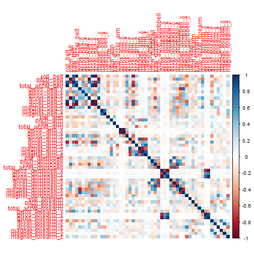
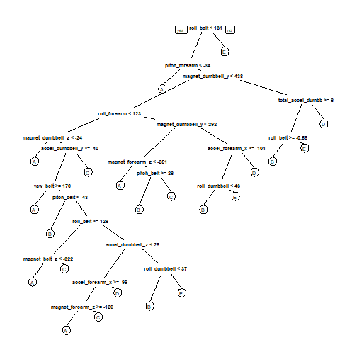

## Overview

Using devices such as Jawbone Up, Nike FuelBand, and Fitbit it is now possible to collect a large amount of data about personal activity relatively inexpensively. These type of devices are part of the quantified self movement - a group of enthusiasts who take measurements about themselves regularly to improve their health, to find patterns in their behavior, or because they are tech geeks. One thing that people regularly do is quantify how much of a particular activity they do, but they rarely quantify how well they do it.
In this project, we will use data from accelerometers on the belt, forearm, arm, and dumbell of 6 participants. They were asked to perform barbell lifts correctly and incorrectly in 5 different ways.


## Envirronment 

```r
library(caret)
library(rpart)
library(rpart.plot)
library(randomForest)
library(corrplot)
```

### Download the Data

```r
trainUrl <-"https://d396qusza40orc.cloudfront.net/predmachlearn/pml-training.csv"
testUrl <- "https://d396qusza40orc.cloudfront.net/predmachlearn/pml-testing.csv"
```

### Read the Data

```r
training <- read.csv(url(trainUrl))
valid <- read.csv(url(testUrl))

dim(training)
```

```
## [1] 19622   160
```

```r
dim(valid)
```

```
## [1]  20 160
```
The training data set contains 19622 observations and 160 variables, while the testing data set contains 20 observations and 160 variables. 

First, we remove columns that contain NA missing values.

```r
training <- training[, colSums(is.na(training)) == 0] 
valid <- valid[, colSums(is.na(valid)) == 0] 
```

Next, we get rid of some columns that do not contribute much to the accelerometer measurements.

```r
classe <- training$classe
training_remove <- grepl("^X|timestamp|window", names(training))
training <- training[, !training_remove]
training_cleaned <- training[, sapply(training, is.numeric)]
training_cleaned$classe <- classe
valid_remove <- grepl("^X|timestamp|window", names(valid))
valid <- valid[, !valid_remove]
valid_cleaned <- valid[, sapply(valid, is.numeric)]
```


### Slice the data
Then, we can split the cleaned training set into a pure training data set (70%) and a validation data set (30%). We will use the validation data set to conduct cross validation in future steps.  

```r
inTrain <- createDataPartition(training_cleaned$classe, p=0.70, list=F)
trainSet <- training_cleaned[inTrain, ]
testSet <- training_cleaned[-inTrain, ]
```


## Appendix: Figures
1. Correlation Matrix Visualization  

```r
corrPlot <- cor(trainSet[, -length(names(trainSet))])
corrplot(corrPlot, method="color")
```


2. Decision Tree Visualization

```r
treeModel <- rpart(classe ~ ., data=trainSet, method="class")
prp(treeModel) # fast plot
```


